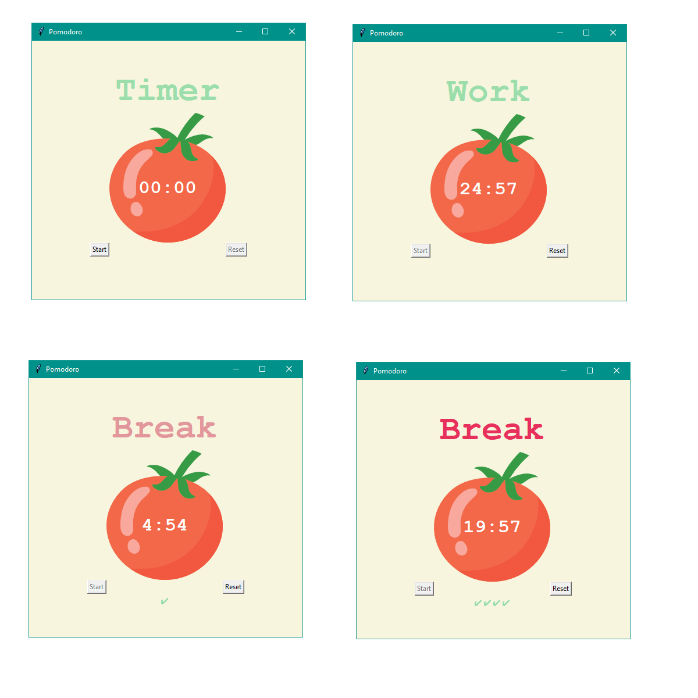

# Pomodoro

A timer which is based on [Pomodoro Technique](https://en.wikipedia.org/wiki/Pomodoro_Technique).  

## Used technologies/frameworks/libraries/languages
Python 3.11, tkinter, math, auto-py-to-exe 2.44.4
## Installation
Download folder "client" and run "Pomodoro.exe". You need to have Python installed on your machine to run this application.
## License
This project is licensed under the MIT License.
